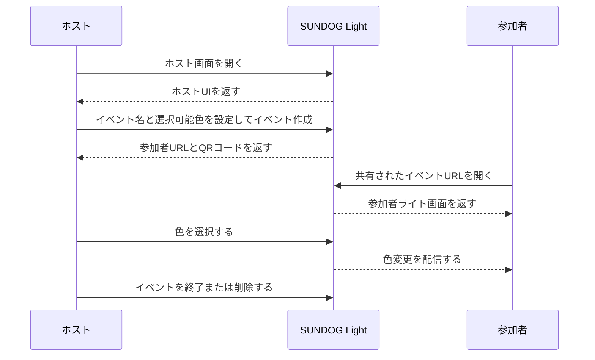
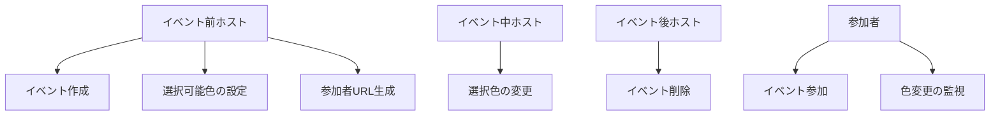

# SUNDOG Light Product Context

このドキュメントは、元の企画書PDFと仕様設計HTMLを読み取り、現在のコードベースと照らして整理したものです。`AGENTS.md` は作業者向けの短い判断基準に留め、詳しい背景や仕様はこのファイルに置きます。

## コンセプト

SUNDOG Light は、スマートフォンの画面に特定の色を表示して、物理的なペンライトやネイティブアプリなしで簡易的なイベントライト体験を再現するWebアプリです。ホストが会場に一体感を作りたい小規模から中規模イベントを主な対象にします。

主な利用シーン:

- 結婚式のお色直しなどで行うドレス色当てクイズ。
- 小規模な音楽イベントで、ホストのタイミングに合わせて参加者画面を同じ色にする演出。
- サークル、パーティー、クイズ、投票などの参加型イベント。

1回だけ使う参加者にも手軽であることが重要です。ネイティブアプリのインストールは負担になるため、Webアプリでの提供が有力とされています。

## 用語

- ホスト: 主催者。イベントを作成し、参加者画面の色を操作する。
- クライアント / 参加者: ゲスト。イベントURLに参加し、ホストの指定した色を画面に表示する。
- イベント: ホストが作成する部屋・文脈。ホストの色操作と参加者画面をつなぐ単位。

## 基本フロー

採用方針はURL/QRコードによるマッチングです。ホストがイベントを作成し、参加者URLを生成し、参加者はそのURLへ直接入ります。

## ユースケースモデル

## 企画書のフェーズ計画

- Phase 1: ユーザー操作により任意の色を自分の端末に表示する。
- Phase 2: ホストがグループ・イベントを作り、参加者スマホにホスト指定色をホスト指定タイミングで表示する。
- Phase 3: ホストが提示した色の選択肢から参加者が色を選び、その色を表示する。
- Phase 4: ホストが指定した画像を表示する。

現在のコードベースは、WebアプリとしてのPhase 2のホスト主導色制御フローを主に実装しています。

## 現在の実装範囲

ホスト画面:

- ホストログイン。
- イベント一覧。
- イベント作成・編集。
- イベント詳細・操作画面。
- 色の設定。
- イベント削除。
- 参加者URLとQRコード共有。

参加者画面:

- `/client/[key]` は「接続中」「色が選択されていません」「選択色の全画面表示」を表示する。
- 初回表示時に現在色を取得し、その後の色更新をリアルタイムに反映する。

現在の連携動作:

- イベント作成と更新では、イベント名、色配列、`#RRGGBB` 形式を検証する。
- 同じ色を再度選ぶと現在色を解除し、未選択状態へ戻す。
- 参加者は初回表示で現在色を取得し、その後の色更新を受け取る。

## 技術選定

- Next.js 16、React 19、TypeScript、Tailwind CSS。
- QRコード生成は `qrcode.react`。
- Google Analytics helper は `src/libs/gtag.ts` にある。

## デザインメモ

- 現在の画面はスマホ利用を前提に、ホスト側も `max-w-lg` 程度の縦長レイアウトが中心。
- 参加者側は装飾よりも画面全体の発色が最重要。

## データモデルメモ

`EventDetail` の現在の構成:

- `name`: イベント表示名。
- `colors`: ホストが選択できる色。
- `uuid`: ホスト詳細・編集ルートと参加者URLに使う公開イベント識別子。
- `lastSelectedColor`: 任意の現在色ミラー。未選択時は `null`。

## プロダクト・UX制約

- 参加者側は極力低フリクションにする。URL/QRコードから入り、色画面を見るだけ。
- ホストは後からイベント編集・確認・削除を行うためログインが必要。
- イベント寿命は現状手動。ホストが作成し、ホストが削除する。サーバー負荷や古いデータが問題化したら自動削除を検討する。
- 主なターゲット層は10代から30代。

## 未決事項・将来案

- 結婚式のドレス色当てクイズなどに使う、参加者の色投票・集計機能。
- 参加者名や「誰が正解したか」を扱う機能。
- 一定期間後のイベント自動削除。
- ホスト別イベント一覧の走査ではなく、イベントUUIDで効率よく引く構造。
- ホスト向けログイン方法の拡張。
- Phase 4の画像表示対応。

## コードベース上の注意点

- 仕様上、参加者はログイン不要。アクセス制御やメンテナンス制御を変えるときは、公開参加フローが維持されているか確認する。
- APIレスポンス形状を変更するときは、サーバーとクライアントを同時に移行する。
- 選択色 `null` は正常な状態であり、エラーではない。
- リアルタイム更新の送受信処理とメッセージ形状は、ホストと参加者で整合させる。
